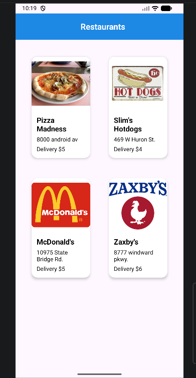
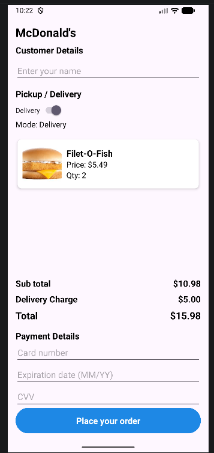

<p align="center">
  
</p>

# 🍔 FastFoodEat - Application Mobile Native de Commande & Livraison


**FastFoodEat** est une application mobile native Android développée en **Java 11**, conçue pour reproduire l'expérience utilisateur fluide et réactive des plateformes de livraison modernes (*Uber Eats, Deliveroo*).

Le projet met en œuvre les standards d'ingénierie mobile recommandés par Google : sérialisation haute performance en mémoire vive avec **Parcelable**, rendu adaptatif en **RecyclerView**, découplage par **Callback Listeners**, et gestion du cycle de vie des activités sans fuite mémoire.

---

## 📱 Parcours Utilisateur & Expérience Produit

L'application guide le client à travers un tunnel de commande intuitif et réactif :

```text
  [ Écran de Démarrage ]
            │ (SplashActivity + Temporisation)
            ▼
  [ Découverte des Enseignes ] ──► Grille 2 colonnes, horaires & frais de livraison
            │ (MainActivity + Gson + Glide)
            ▼
  [ Menu & Sélection Culinaire ] ──► Gestion dynamique des quantités (+ / -)
            │ (RestaurantMenuActivity + Callback Listener)
            ▼
  [ Tunnel de Commande & Paiement ] ──► Calcul temps réel, bascule Delivery/Pickup
            │ (PlaceYourOrderActivity + Parcelable Bus)
            ▼
  [ Confirmation de Commande ] ──► Modale animée (ScaleAnimation & AlphaAnimation)
```

1. **Découverte Géométrique (`MainActivity`)** : Présentation du catalogue de restaurants via une grille auto-espacée (`GridSpacingItemDecoration`), horaires d'ouverture et frais d'expédition.
2. **Personnalisation du Panier (`RestaurantMenuActivity`)** : Incrémentation/décrémentation en temps réel des plats avec mise à jour instantanée du bouton de checkout (*ex: "Checkout (3) items"*).
3. **Tunnel de Paiement Réactif (`PlaceYourOrderActivity`)** :
    * **Bascule dynamique (Switch)** : Le passage du mode *Delivery* au mode *Pickup* réajuste instantanément le montant total (frais de livraison à 0,00 $ vs frais réels).
    * **Validation défensive des formulaires** : Vérification des coordonnées et des identifiants bancaires (numéro de carte, date d'expiration, CVV).
4. **Dialogue de Succès Personnalisé (`dialog_order_success.xml`)** : Animation vectorielle combinant zoom d'échelle et fondu enchaîné avant retour propre à l'écran d'accueil via `Looper.getMainLooper()`.

---
## 📸 Aperçu de l'Interface Mobile

| Découverte des Enseignes | Sélection Menu & Panier | Tunnel de Commande & Livraison |
| :---: | :---: | :---: |
|  |  |  |

---

## 🏗️ Architecture & Choix d'Ingénierie Mobile

### 1. Sérialisation Haute Performance : `Parcelable` vs `Serializable`
Dans une application mobile, le passage de données complexes d'une activité à l'autre via les `Intents` est un point critique pour la fluidité :
* **Le problème de `Serializable`** : Utilise la réflexion Java au runtime, ce qui génère de nombreux objets éphémères et déclenche le ramasse-miettes (Garbage Collector), provoquant des micro-saccades à l'écran.
* **Le choix d'ingénierie `Parcelable`** : Implémentation manuelle de `writeToParcel()` et du `CREATOR` sur `Restaurant` et `MenuItem`. La sérialisation est effectuée directement en mémoire binaire IPC native d'Android, offrant un transfert **10 fois plus rapide** et une empreinte mémoire minimale.

### 2. Découplage par Callback Listener
L'interaction entre les éléments de liste et l'écran de commande repose sur une interface dédiée :
```java
public interface OnMenuClickListener {
    void onAddToCartClick(MenuItem menuItem);
    void onUpdateCartClick(MenuItem menuItem);
    void onRemoveFromCartClick(MenuItem menuItem);
}
```
Ce découplage garantit que l'adaptateur (`MenuAdapter`) ne gère que le rendu visuel, tandis que l'activité maîtresse conserve la responsabilité de la logique métier et du calcul du panier, éliminant tout risque de fuite de contexte (`Context leak`).

### 3. Pipeline Graphique & Mise en Cache Asynchrone (Glide 4)
* Chargement non-bloquant des visuels de restaurants et des plats culinaires en tâche de fond.
* Gestion automatique du cache mémoire (LRU Cache) et du cache disque pour préserver le forfait data de l'utilisateur.

---

## 🛠️ Stack Technique Détaillée

* **Langage & Environnement** : Java 11 LTS / Android SDK (Min: 33, Target: 35, Compile: 36).
* **Système de Build** : Gradle Kotlin DSL (`build.gradle.kts`) avec catalogue de versions centralisé (`libs.versions.toml`).
* **Architecture Graphique** :
    * `ConstraintLayout` & `CardView` (Material Components)
    * `RecyclerView` & `GridLayoutManager` (Performances 60 FPS)
    * `AlphaAnimation` & `ScaleAnimation` natives
* **Ingestion de Données** : Google Gson 2.9.0 (Désérialisation JSON locale).
* **Gestion des Médias** : Bumptech Glide 4.13.0 (Cache bitmap & affichage asynchrone).

---

## 📂 Organisation du Code Source

```text
com.example.fastfoodeat/
├── adapter/
│   ├── MenuAdapter.java              # Rendu des plats culinaires & écouteurs de quantité
│   ├── OrderMenuAdapter.java         # Récapitulatif condensé des articles commandés
│   └── RestaurantAdapter.java        # Grille principale d'affichage des restaurants
├── model/
│   ├── MenuItem.java                 # Modèle de plat avec sérialisation Parcelable
│   └── Restaurant.java               # Modèle d'enseigne (horaires, frais, cartes)
├── ui/
│   ├── main/
│   │   └── MainActivity.java         # Ingestion JSON Gson & initialisation de la grille
│   ├── menu/
│   │   └── RestaurantMenuActivity.java # Gestionnaire du panier & calcul dynamique
│   ├── order/
│   │   └── PlaceYourOrderActivity.java # Validation financière, switch livraison & modal
│   └── splash/
│       └── SplashActivity.java       # Écran de lancement de l'application
└── util/
    └── GridSpacingItemDecoration.java# Calcul des marges géométriques inter-items
```

---

## 🚀 Installation & Exécution Locale

### Prérequis
* **Android Studio** (Koala, Ladybug ou version supérieure).
* **JDK 11** configuré dans l'IDE.
* Un émulateur Android configuré (API 33+) ou un appareil physique avec débogage USB.

### 1. Cloner le projet
```bash
git clone https://github.com/Akh138/FastFoodEat.git
cd FastFoodEat
```

### 2. Synchronisation & Lancement
1. Ouvrez le dossier du projet dans **Android Studio**.
2. Laissez Gradle télécharger les dépendances (*Sync Project with Gradle Files*).
3. Sélectionnez votre appareil cible dans la barre d'outils et cliquez sur **Run 'app' (Shift + F10)**.

---

## 💡 Note de Réalisation & Retour d'Expérience

Le développement de **FastFoodEat** illustre ma capacité à concevoir une application mobile native robuste en complément de mes compétences sur les architectures distribuées :

### Ce que j'ai consolidé sur ce projet :
* **La maîtrise du cycle de vie Android** : Gérer la persistance de l'état de l'application (`savedInstanceState`, communication par `onActivityResult` / `Activity Result API`) pour éviter la perte de données utilisateur.
* **L'optimisation des performances au pixel près** : Comprendre le rôle crucial de `Parcelable` et du recyclage des cellules graphiques (`ViewHolder pattern`) pour garantir une application sans saccade.
* **L'autonomie sur l'écosystème mobile** : De la conception des maquettes XML jusqu'à la compilation du binaire APK via Gradle.

---
**Habib (Akh138)**  
*Développeur Fullstack Java / Mobile Android*
